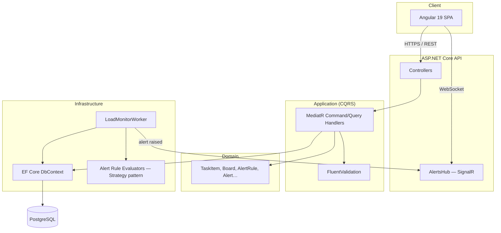

# TaskFlow

A task management API and web client with **automatic workload-anomaly detection**: a
background worker continuously watches every board's task load and pushes real-time
alerts the moment a team member is overloaded, a board's active-task count spikes, or
someone is juggling too many tasks at once.

Built as a portfolio project to demonstrate Clean Architecture, CQRS, a real background
worker with a pluggable rule engine, real-time notifications, and a fully containerized,
one-command demo — not just CRUD.

## Why this project exists

Most task trackers show you what's overdue *after you go looking*. TaskFlow's worker
looks for you: it snapshots every board's workload on a schedule, compares it against
configurable thresholds, and raises an alert — instantly visible in the UI — the moment
something crosses a line. See [`docs/adr/0004-alert-rule-strategy-pattern.md`](docs/adr/0004-alert-rule-strategy-pattern.md)
for how new rule types are added without touching the worker itself.

## Architecture



**Clean Architecture, four layers, dependencies point inward:**

| Layer | Responsibility |
|---|---|
| `Domain` | Entities with encapsulated behavior (e.g. `TaskItem`'s state machine), no dependencies on anything else |
| `Application` | CQRS commands/queries via MediatR, validation, interfaces that Infrastructure implements |
| `Infrastructure` | EF Core, the `LoadMonitorWorker` background service, alert rule evaluators, SignalR |
| `Api` | Controllers, middleware, composition root (`Program.cs`) |

The **anomaly-detection feature** lives in `Infrastructure/Workers`: `LoadMonitorWorker` runs
on a timer, snapshots every board's load into `LoadMetric` history, then evaluates every
enabled `AlertRule` through a matching `IAlertRuleEvaluator` (Strategy pattern — see the ADR).
Matches are pushed live to connected clients over SignalR and deduplicated so the same
standing condition doesn't spam a new alert every cycle.

## Tech stack

See [`OVERVIEW.md`](OVERVIEW.md) for the full breakdown of every library and module.

- **Backend:** .NET 10, ASP.NET Core Web API, EF Core 9 (PostgreSQL), MediatR, FluentValidation, SignalR, Serilog
- **Frontend:** Angular 19, standalone components, signals, `@microsoft/signalr`
- **Tests:** xUnit + FluentAssertions (unit), Testcontainers + `WebApplicationFactory` (integration, real Postgres)
- **Infra:** Docker Compose (Postgres + API + Angular/nginx), GitHub Actions CI/CD

## Running the demo

Requirements: Docker Desktop, .NET 10 SDK (for the one-time migration step), the `dotnet-ef` tool.

```bash
# 1. Restore & build (sanity check)
dotnet restore
dotnet build

# 2. One-time: generate the initial EF Core migration
dotnet tool install --global dotnet-ef   # if not already installed
dotnet ef migrations add InitialCreate --project src/Infrastructure --startup-project src/Api

# 3. Run everything
docker compose up --build
```

Then open:

| What | URL |
|---|---|
| Web app | http://localhost:4200 |
| API + Swagger | http://localhost:5080/swagger |
| Health check | http://localhost:5080/health |

`docker compose up` applies pending EF Core migrations automatically on API startup, so no
manual `dotnet ef database update` step is needed after the first migration exists.

## Running tests

```bash
# Unit tests (Domain + Application, no external dependencies)
dotnet test tests/UnitTests/TaskFlow.UnitTests.csproj

# Integration tests (spins up a real, disposable Postgres container via Testcontainers —
# requires Docker to be running)
dotnet test tests/IntegrationTests/TaskFlow.IntegrationTests.csproj
```

## Project structure

```
src/
  Domain/            entities, enums, domain events, Result<T>
  Application/        CQRS handlers, validators, interfaces
  Infrastructure/      EF Core, LoadMonitorWorker, alert evaluators, SignalR
  Api/                 controllers, middleware, Program.cs
frontend/              Angular 19 SPA
tests/
  UnitTests/           Domain + Application unit tests
  IntegrationTests/     end-to-end API tests against a real Postgres (Testcontainers)
docs/adr/               architecture decision records
```

## Architecture Decision Records

- [0001 — PostgreSQL as the datastore](docs/adr/0001-postgresql.md)
- [0002 — Clean Architecture + CQRS](docs/adr/0002-clean-architecture-cqrs.md)
- [0003 — SignalR for real-time alerts](docs/adr/0003-signalr-realtime-alerts.md)
- [0004 — Strategy pattern for alert rule evaluation](docs/adr/0004-alert-rule-strategy-pattern.md)
