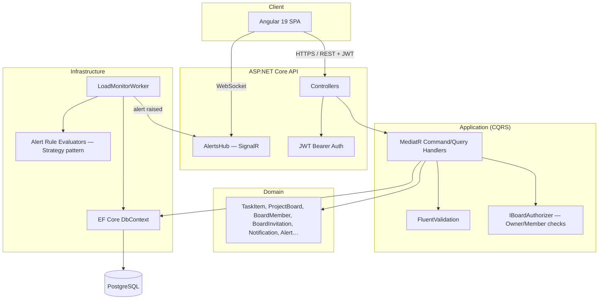

# TaskFlow

[](https://github.com/Lucaalex00/taskflow/actions/workflows/ci.yml)


A task management platform with **automatic workload-anomaly detection**: a background worker
continuously watches every board's task load and pushes real-time alerts the moment a team
member is overloaded, a board's active-task count spikes, or someone is juggling too many
tasks at once — plus real authentication, board-scoped roles, an invitation/notification
system, and per-board access control. Not a CRUD demo.

**Try it in under two minutes:** `docker compose up --build` — see [Quick start](#quick-start).

---

## Table of contents

- [Why this project exists](#why-this-project-exists)
- [Key features](#key-features)
- [Quick start](#quick-start)
- [Try the full workflow](#try-the-full-workflow)
- [Architecture](#architecture)
- [Tech stack](#tech-stack)
- [Testing](#testing)
- [Project structure](#project-structure)
- [Documentation](#documentation)
- [Roadmap](#roadmap)

## Why this project exists

Most task trackers show you what's overdue *after you go looking*. TaskFlow's background
worker looks for you: it snapshots every board's workload on a schedule, compares it against
configurable thresholds, and raises an alert — instantly visible in the UI over a WebSocket,
no polling — the moment something crosses a line. New alert rules plug in without touching the
worker itself (see [ADR 0004](docs/adr/0004-alert-rule-strategy-pattern.md)).

On top of that, TaskFlow models how a real team actually works: boards have an **Owner** who
creates work and controls membership, and **Members** who get invited (by email, with a
real accept/decline step), get assigned tasks, and move their own work through the board — but
never assign work to themselves or each other. It's built to demonstrate production patterns —
Clean Architecture, CQRS, JWT auth, role-based access control, a real background worker with a
pluggable rule engine, real-time delivery, and a fully containerized one-command demo — with
the test suite to back every one of them up.

## Key features

**Workload anomaly detection**
- A `BackgroundService` snapshots every board's load on a timer and evaluates configurable,
  per-board threshold rules (overdue tasks per user, board load spikes, concurrent
  in-progress tasks per user) through a Strategy-pattern evaluator.
- Alerts are pushed live to connected clients over SignalR, deduplicated so a standing
  condition doesn't re-alert every cycle.

**Real authentication & authorization**
- Password registration/login with PBKDF2-HMAC-SHA256 hashing and JWT bearer tokens —
  every endpoint requires authentication, including the SignalR hub itself.
- Login/register are rate-limited per IP against brute-force/credential-stuffing attempts.
- Board-scoped **Owner / Member** roles, enforced consistently through a single
  `IBoardAuthorizer` abstraction: only Owners create tasks, assign them, manage membership,
  and configure alert rules; Members can still move their own assigned tasks through the
  state machine.

**Invitations & notifications**
- Owners invite teammates by **email** — invites to not-yet-registered addresses stay
  pending and activate automatically once that person signs up.
- Invitees get a real in-app notification and must **accept** before joining (always as
  Member; promotion to Owner is a separate, later action).
- A notification center also surfaces task assignments and task state changes — but never
  for your own actions.

**Task management**
- An explicit `TaskItem` state machine (`Todo → InProgress → {Blocked, Done, Cancelled}`)
  enforced in the domain layer, mirrored exactly by the UI's transition buttons.
- Board and user colors for quick visual identification across the board list and task cards.

**Engineering quality**
- Clean Architecture (Domain → Application → Infrastructure → Api), CQRS via MediatR,
  FluentValidation pipeline behavior, domain events dispatched through a real (not
  theoretical) MediatR-based mechanism.
- **213 automated tests** — 104 backend unit, 20 backend integration (against a real,
  disposable Postgres container via Testcontainers), 83 frontend, 6 end-to-end (Playwright,
  driving two real browser contexts through the full owner/member workflow against the actual
  Docker stack) — plus a GitHub Actions pipeline that runs all of them, plus lint and a
  production build, on every push.

## Quick start

**Requirements:** Docker Desktop (that's it — no local .NET/Node/Postgres install needed).

```bash
git clone https://github.com/Lucaalex00/taskflow.git
cd taskflow
docker compose up --build
```

That's the whole setup — EF Core migrations apply automatically on API startup, so there's no
manual database step. First build takes about a minute; subsequent starts are seconds.

| What | URL |
|---|---|
| Web app | http://localhost:4200 |
| API + Swagger | http://localhost:5080/swagger |
| Health check | http://localhost:5080/health |

```bash
docker compose logs api -f     # tail API logs (Serilog output)
docker compose down            # stop (keeps the Postgres volume)
docker compose down -v         # stop and wipe all data
```

## Try the full workflow

The interesting part of TaskFlow isn't visible from an empty board — here's a two-minute path
that exercises the role/invitation/notification system end to end, straight against the API
(swap in the web app at http://localhost:4200 for the same flow with a UI):

```bash
# 1. Register the board owner
curl -s -X POST http://localhost:5080/api/users -H "Content-Type: application/json" \
  -d '{"email":"owner@example.com","displayName":"Owner","password":"correct-horse-battery-staple"}'
# → { "userId": "...", "token": "..." }  — save the token as $OWNER_TOKEN

# 2. Create a board (color is optional, falls back to a random accent)
curl -s -X POST http://localhost:5080/api/boards -H "Authorization: Bearer $OWNER_TOKEN" \
  -H "Content-Type: application/json" -d '{"name":"Launch Plan","color":"#4fd1c5"}'
# → "<boardId>"

# 3. Invite a teammate by email — works even if they haven't registered yet
curl -s -X POST http://localhost:5080/api/boards/<boardId>/invitations \
  -H "Authorization: Bearer $OWNER_TOKEN" -H "Content-Type: application/json" \
  -d '{"email":"teammate@example.com"}'

# 4. Register the teammate, then check their notifications
curl -s -X POST http://localhost:5080/api/users -H "Content-Type: application/json" \
  -d '{"email":"teammate@example.com","displayName":"Teammate","password":"correct-horse-battery-staple"}'
curl -s http://localhost:5080/api/notifications -H "Authorization: Bearer $TEAMMATE_TOKEN"
# → the board invitation notification, with an invitationId to respond to

# 5. Accept it — they're now a Member of the board
curl -s -X POST http://localhost:5080/api/invitations/<invitationId>/respond \
  -H "Authorization: Bearer $TEAMMATE_TOKEN" -H "Content-Type: application/json" -d '{"accept":true}'

# 6. Owner creates a task and assigns it to the teammate — the teammate gets notified
curl -s -X POST http://localhost:5080/api/boards/<boardId>/tasks -H "Authorization: Bearer $OWNER_TOKEN" \
  -H "Content-Type: application/json" \
  -d '{"title":"Draft the launch plan","description":null,"priority":"High","dueAtUtc":null}'
```

Try having the teammate attempt step 6 themselves — it 403s. Only the Owner assigns work.

## Architecture


```mermaid
flowchart TB
    subgraph Client
        UI[Angular 19 SPA]
    end

    subgraph API["ASP.NET Core API"]
        Controllers[Controllers]
        Hub[AlertsHub — SignalR]
        Auth[JWT Bearer Auth]
    end

    subgraph Application["Application (CQRS)"]
        Handlers[MediatR Command/Query Handlers]
        Validators[FluentValidation]
        BoardAuth[IBoardAuthorizer — Owner/Member checks]
    end

    subgraph Domain
        Entities[TaskItem, ProjectBoard, BoardMember, BoardInvitation, Notification, Alert…]
    end

    subgraph Infrastructure
        DbContext[EF Core DbContext]
        Worker[LoadMonitorWorker]
        Evaluators[Alert Rule Evaluators — Strategy pattern]
    end

    DB[(PostgreSQL)]

    UI -- HTTPS / REST + JWT --> Controllers
    UI -- WebSocket --> Hub
    Controllers --> Auth
    Controllers --> Handlers
    Handlers --> Validators
    Handlers --> BoardAuth
    Handlers --> Entities
    Handlers --> DbContext
    Worker --> Evaluators
    Worker --> DbContext
    Worker -- alert raised --> Hub
    DbContext --> DB
```

**Clean Architecture, four layers, dependencies point inward:**

| Layer | Responsibility |
|---|---|
| `Domain` | Entities with encapsulated behavior (e.g. `TaskItem`'s state machine, `BoardInvitation`'s accept/decline), zero dependencies on anything else |
| `Application` | CQRS commands/queries via MediatR, validation, `IBoardAuthorizer` for role checks, interfaces that Infrastructure implements |
| `Infrastructure` | EF Core, JWT issuance, password hashing, the `LoadMonitorWorker` background service, alert rule evaluators, SignalR |
| `Api` | Controllers, JWT bearer middleware, exception-to-`ProblemDetails` middleware, composition root (`Program.cs`) |

## Tech stack

See [`OVERVIEW.md`](OVERVIEW.md) for the full breakdown of every library and module.

- **Backend:** .NET 10, ASP.NET Core Web API, EF Core 9 (PostgreSQL), MediatR, FluentValidation, SignalR, Serilog, JWT bearer authentication
- **Frontend:** Angular 19, standalone components, signals, `@microsoft/signalr`
- **Tests:** xUnit + FluentAssertions (unit), Testcontainers + `WebApplicationFactory` (integration, real Postgres), Karma + Jasmine (frontend)
- **Infra:** Docker Compose (Postgres + API + Angular/nginx), GitHub Actions CI/CD (backend + frontend test/build, Docker image publish to GHCR)

## Testing

```bash
# Backend — unit tests (Domain + Application, no external dependencies)
dotnet test tests/UnitTests/TaskFlow.UnitTests.csproj

# Backend — integration tests (spins up a real, disposable Postgres container via
# Testcontainers — requires Docker to be running)
dotnet test tests/IntegrationTests/TaskFlow.IntegrationTests.csproj

# Frontend
cd frontend
npx ng test --watch=false --browsers=ChromeHeadless
npx ng lint

# End-to-end (Playwright, against the real Docker stack — start it first)
docker compose -f docker-compose.yml -f docker-compose.e2e.yml up --build -d
cd e2e && npm ci && npx playwright install --with-deps chromium && npx playwright test
```

| Suite | Count | What it covers |
|---|---|---|
| Backend unit | 104 | Domain rules (state machines, validation, color palette), CQRS handlers against an EF Core InMemory context |
| Backend integration | 20 | Full HTTP round-trips against a real Postgres container: auth, rate limiting, board membership/roles, invitations, notifications, SignalR hub authorization |
| Frontend | 83 | Services (HTTP contracts), components (behavior via mocked services), interceptors, guards |
| End-to-end | 6 | Playwright driving real Chromium browsers against the actual Docker stack: auth, board creation, and the full owner/member invite → accept → assign → move-task workflow across two simultaneous identities |

## Project structure

```
src/
  Domain/            entities, enums, domain events, Result<T> — zero external dependencies
  Application/        CQRS handlers, validators, IBoardAuthorizer, interfaces
  Infrastructure/      EF Core, LoadMonitorWorker, alert evaluators, SignalR, JWT/password hashing
  Api/                 controllers, middleware, Program.cs
frontend/              Angular 19 SPA
tests/
  UnitTests/           Domain + Application unit tests
  IntegrationTests/     API integration tests against a real Postgres (Testcontainers)
e2e/                   Playwright end-to-end tests against the full Docker stack
docs/
  adr/                 architecture decision records
  *.md                 dated notes on individual features/fixes as they were built
```

## Documentation

- [`OVERVIEW.md`](OVERVIEW.md) — every library, module, and command in detail
- Architecture Decision Records:
  [0001 — PostgreSQL](docs/adr/0001-postgresql.md) ·
  [0002 — Clean Architecture + CQRS](docs/adr/0002-clean-architecture-cqrs.md) ·
  [0003 — SignalR for real-time alerts](docs/adr/0003-signalr-realtime-alerts.md) ·
  [0004 — Strategy pattern for alert rules](docs/adr/0004-alert-rule-strategy-pattern.md)
- `docs/*.md` — dated write-ups of individual features as they were built (auth, board roles,
  invitations/notifications, colors, and a couple of real bugs found and fixed along the way),
  each with what changed, why, and how it was verified.

## Roadmap

Explicitly out of scope for now — see [`OVERVIEW.md`](OVERVIEW.md#5-future-work-explicitly-out-of-scope-for-v1)
for the current list (e.g. renaming/deleting a board, changing a member's role beyond
promote/demote-in-place already supported).
