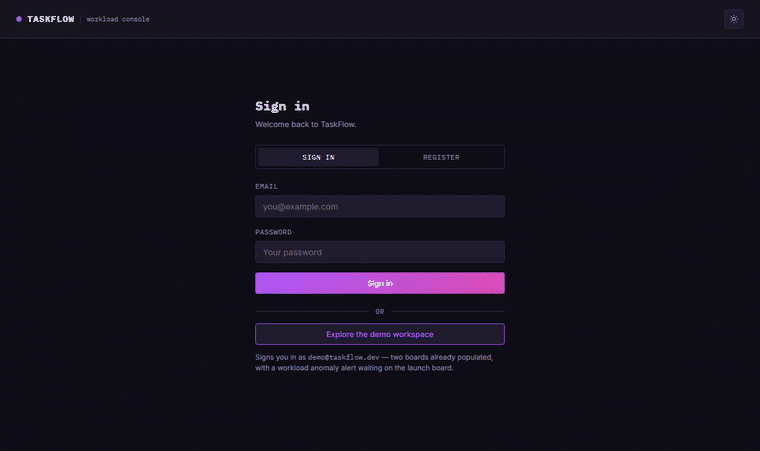
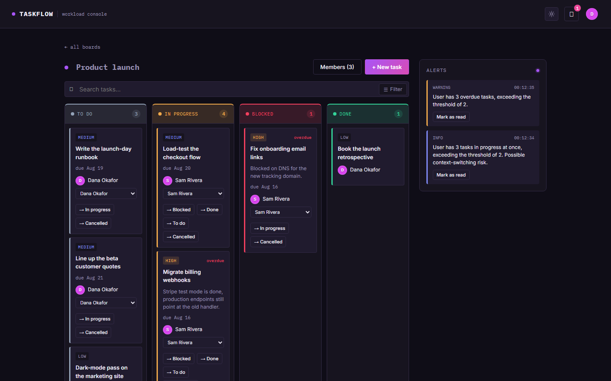
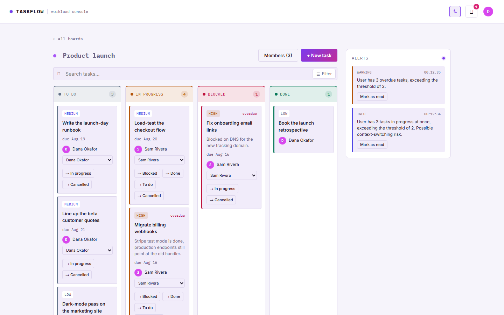
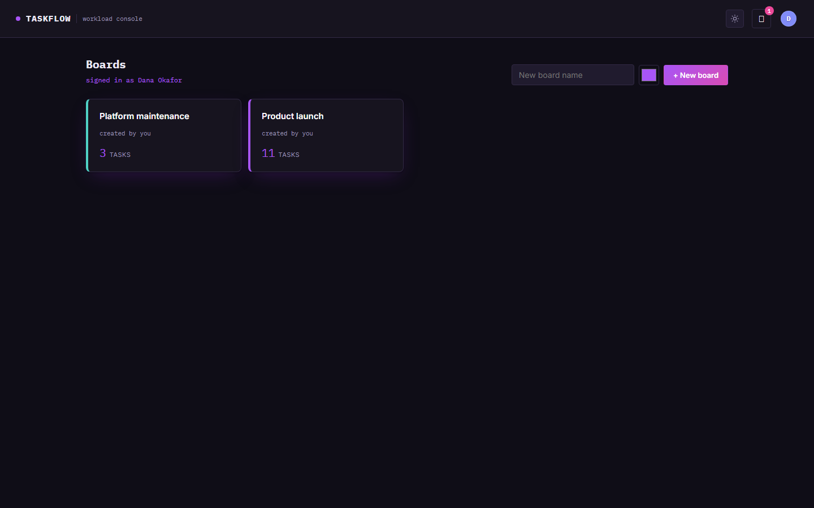
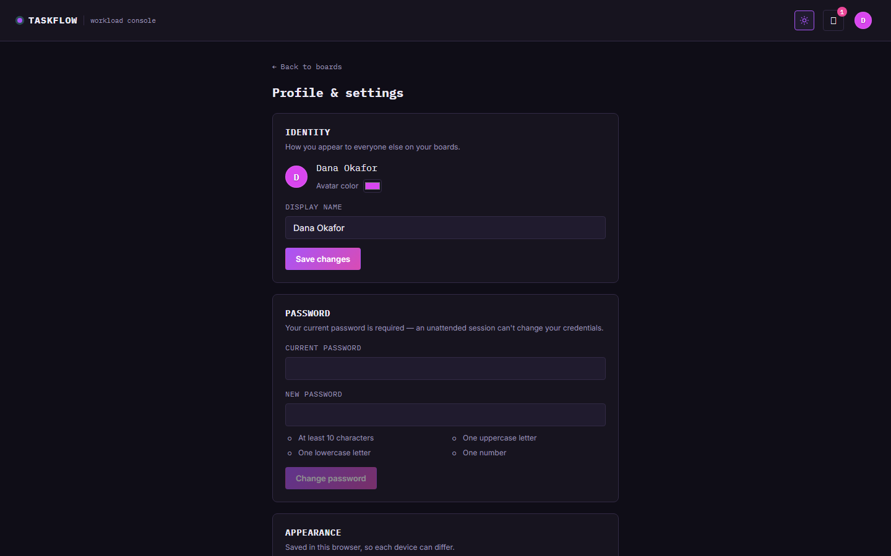
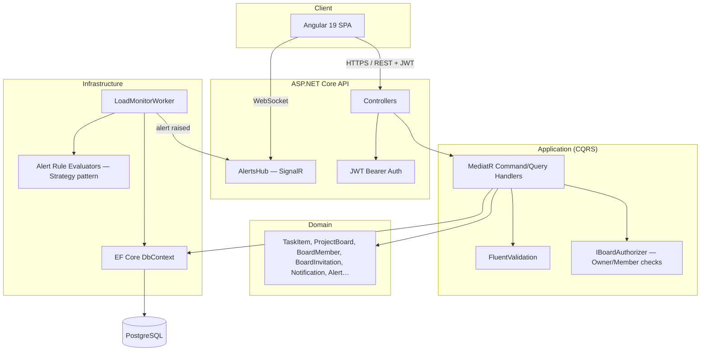

# TaskFlow

[](https://github.com/Lucaalex00/taskflow/actions/workflows/ci.yml)


**A team task tracker that watches workload and raises real-time alerts before someone drowns
in it.** A background worker snapshots every board on a timer, evaluates configurable threshold
rules, and pushes alerts to the browser over a WebSocket — on top of real authentication,
board-scoped roles, and an invitation flow. Not a CRUD demo.

## Run it

**Docker is the only requirement.** Nothing to install, nothing to configure, no account to create.

```bash
git clone https://github.com/Lucaalex00/taskflow.git && cd taskflow
docker compose -f docker-compose.yml -f docker-compose.prebuilt.yml up -d
```

Then open **http://localhost:4200** and click **Explore the demo workspace**.

That's it. No build step — it pulls the images CI publishes on every green run. Measured from zero
images on a warm Docker over a home connection: **16 seconds** to a seeded workspace with two
populated boards and workload alerts already raised. Prefer to build from source? See
[Quick start](#quick-start).



## What this demonstrates

- **A real background service, not a cron stub** — [`LoadMonitorWorker`](src/Infrastructure/Workers/LoadMonitorWorker.cs)
  snapshots load and dispatches to per-rule [evaluators](src/Infrastructure/Workers/AlertEvaluators/);
  a new rule type is a new class, never a change to the worker
  ([why](docs/adr/0004-alert-rule-strategy-pattern.md)).
- **Tests that would actually catch a regression** — 362 of them, including 51 full HTTP
  round-trips against a **real Postgres container**, not mocks
  ([example](tests/IntegrationTests/DemoSeedTests.cs)), and 8 Playwright runs against the
  Docker stack.
- **Business rules in the domain, not in controllers** — every legal task transition is
  enumerated in one place ([`TaskItem`](src/Domain/Entities/TaskItem.cs)), and every
  permission check funnels through one chokepoint
  ([`BoardAuthorizer`](src/Application/Common/Services/BoardAuthorizer.cs)).
- **Security treated as a requirement** — JWT on every endpoint *including the SignalR hub*,
  per-IP rate limiting plus per-account lockout, PBKDF2 password hashing, and a strict CSP on
  both the API and nginx.
- **Reproducible by design** — one command, migrations and demo data applied automatically, a
  demo workspace that [rebuilds itself weekly](docs/deploying.md#the-weekly-reset), and CI that
  runs every suite before publishing the images above.

## Reviewing this in 5 minutes

If you're deciding whether this is worth a longer look, these four are the ones I'd read:

| Look at | Why |
|---|---|
| [`TaskItem.cs`](src/Domain/Entities/TaskItem.cs) | The state machine: every allowed transition in one auditable table, enforced in the domain and mirrored exactly by the UI's buttons. |
| [`OverdueTasksThresholdEvaluator.cs`](src/Infrastructure/Workers/AlertEvaluators/OverdueTasksThresholdEvaluator.cs) | The whole "anomaly detection" feature in one 38-line class, and the shape every new rule plugs into. |
| [`BoardMembersEndpointsTests.cs`](tests/IntegrationTests/BoardMembersEndpointsTests.cs) | How the Owner/Member boundary is proven: real HTTP, real Postgres, real 403s. |
| [The `ValidationBehavior` bug](docs/2026-08-14-demo-seed-configuration-and-personalization.md#a-real-bug-this-surfaced) | A silent defect found by a test, why MediatR made it possible, and the test that stops it coming back. |

Built over about four weeks of evenings, in 41 commits, with a dated write-up in
[`docs/`](docs/) for every feature explaining what changed, why, and how it was verified.

## Why this project exists

Most task trackers show you what's overdue *after you go looking*. TaskFlow's background
worker looks for you: it snapshots every board's workload on a schedule, compares it against
configurable thresholds, and raises an alert — instantly visible in the UI over a WebSocket,
no polling — the moment something crosses a line. New alert rules plug in without touching the
worker itself (see [ADR 0004](docs/adr/0004-alert-rule-strategy-pattern.md)).

On top of that, TaskFlow models how a real team actually works: boards have an **Owner** who
creates work and controls membership, and **Members** who get invited (by email, with a
real accept/decline step), get assigned tasks, and move their own work through the board — but
never assign work to themselves or each other. It's built to demonstrate production patterns —
Clean Architecture, CQRS, JWT auth, role-based access control, a real background worker with a
pluggable rule engine, real-time delivery, and a fully containerized one-command demo — with
the test suite to back every one of them up.

## Key features

**Workload anomaly detection**
- A `BackgroundService` snapshots every board's load on a timer and evaluates configurable,
  per-board threshold rules (overdue tasks per user, board load spikes, concurrent
  in-progress tasks per user) through a Strategy-pattern evaluator.
- Alerts are pushed live to connected clients over SignalR, deduplicated so a standing
  condition doesn't re-alert every cycle.

**Real authentication & authorization**
- Password registration/login with PBKDF2-HMAC-SHA256 hashing and JWT bearer tokens —
  every endpoint requires authentication, including the SignalR hub itself.
- Login/register are rate-limited per IP against brute-force/credential-stuffing attempts, and
  a single account locks temporarily after repeated failures (defends against an attacker
  rotating IPs, which per-IP limiting alone wouldn't stop).
- A real password policy (length + upper/lower/number), enforced server-side and mirrored by a
  live requirements checklist in the registration form.
- Defensive HTTP headers on every response (strict CSP, HSTS, X-Frame-Options,
  X-Content-Type-Options, Referrer-Policy) on both the API and the nginx-served frontend.
- Board-scoped **Owner / Member** roles, enforced consistently through a single
  `IBoardAuthorizer` abstraction: only Owners create tasks, assign them, manage membership,
  and configure alert rules; Members can still move their own assigned tasks through the
  state machine.

**Invitations & notifications**
- Owners invite teammates by **email** — invites to not-yet-registered addresses stay
  pending and activate automatically once that person signs up.
- Invitees get a real in-app notification and must **accept** before joining (always as
  Member; promotion to Owner is a separate, later action).
- A notification center also surfaces task assignments and task state changes — but never
  for your own actions.

**Task management**
- An explicit `TaskItem` state machine (`Todo → InProgress → {Blocked, Done, Cancelled}`)
  enforced in the domain layer, mirrored exactly by the UI's transition buttons.
- A traffic-light color-coded Kanban board with **drag & drop** between columns (which still
  respects the domain's valid transitions), a **search + filter dropdown** (title, assignee,
  priority, show-completed), and toast confirmations.
- Closing a task (→ Done) asks for confirmation, then locks the card; a completed task can be
  **archived** (a logical delete — hidden from the board but kept in the database, viewable via
  "show completed").
- **Avatars** (initial on a user-chosen color, changeable any time) for instant recognition of
  assignees and members; board colors for visual identification across the board list.

**Make it yours**
- A light theme alongside the dark "workload console" default, toggled from the header and
  remembered per browser — the whole UI is driven by design tokens, so it's one attribute on
  `<html>`, not a second stylesheet.
- A profile page to change your display name, your avatar colour, and your password (the
  current one is required, and the new one goes through the same policy as registration).
- Everything about the instance itself — ports, database credentials, JWT signing key and
  lifetime, rate limits, monitor interval, whether to seed demo data — is an environment
  variable with a working default. See [Configuration](#configuration).

**Demo that maintains itself**
- The seeded workspace rebuilds on a schedule (`SEED_RESET_INTERVAL_HOURS`, weekly by default),
  wiping anything visitors created — so a link you shared a fortnight ago still shows the demo
  as intended. The clock is the workspace's own age, not a timer started at boot, so a free-tier
  host that sleeps between visits still refreshes properly.
- Both images take their configuration at start-up (including nginx's upstream), so deploying
  the published images somewhere public is configuration rather than a rebuild — see
  [`docs/deploying.md`](docs/deploying.md).

**Engineering quality**
- Clean Architecture (Domain → Application → Infrastructure → Api), CQRS via MediatR,
  FluentValidation pipeline behavior, domain events dispatched through a real (not
  theoretical) MediatR-based mechanism.
- **362 automated tests** — 166 backend unit, 51 backend integration (against a real,
  disposable Postgres container via Testcontainers), 137 frontend, 8 end-to-end (Playwright,
  driving real browser contexts through the full owner/member workflow and drag & drop against
  the actual Docker stack) — plus a GitHub Actions pipeline that runs all of them, plus lint and
  a production build, on every push.

## Quick start

**Requirements:** Docker Desktop. That's the whole list — no local .NET, Node or Postgres.

### The fast way (no build)

```bash
docker compose -f docker-compose.yml -f docker-compose.prebuilt.yml up -d
```

Pulls the images CI publishes on every green run — seconds, not minutes. This is the one to use
if you just want to see the app.

### Building from source

```bash
docker compose up --build
```

Same result, built locally: a few minutes the first time, seconds afterwards. Use this if
you've changed the code.

Either way there is no database step — EF Core migrations apply on API startup, and an empty
database is seeded with a demo workspace.

| What | URL |
|---|---|
| Web app | http://localhost:4200 |
| API + Swagger | http://localhost:5080/swagger |
| Health check | http://localhost:5080/health |

### Signing in

Click **Explore the demo workspace** on the login screen. Behind it: `demo@taskflow.dev` /
`Demo-password-2026` — two populated boards, three users with different roles, a pending
invitation in the notification bell, and enough overdue work that the anomaly detector raises a
real alert on its first cycle.

The teammates are `sam@taskflow.dev` and `priya@taskflow.dev`, same password. Open one in a
second browser profile to watch both sides of the invite → accept → assign flow at once.

### Day-to-day

```bash
docker compose logs api -f     # tail API logs (Serilog output)
docker compose down            # stop (keeps the Postgres volume)
docker compose down -v         # stop and wipe all data (the next start re-seeds the demo)
```

A `Makefile` wraps all of it — `make up`, `make demo`, `make reset`, `make test`, `make media` —
run `make` on its own for the list.

## Configuration

Nothing needs configuring to run the demo, and nothing is hardcoded either: every knob is an
environment variable with a sensible default. Copy `.env.example` to `.env` (or run `make env`)
and change what you like — Docker Compose picks it up automatically.

| Variable | Default | What it does |
|---|---|---|
| `WEB_PORT` / `API_PORT` / `POSTGRES_PORT` | `4200` / `5080` / `5432` | Host ports. Change `POSTGRES_PORT` if you already run a local Postgres. |
| `POSTGRES_DB` / `POSTGRES_USER` / `POSTGRES_PASSWORD` | `taskflow` | Database name and credentials. |
| `JWT_SECRET` | built-in demo key | Token signing key. The API **refuses to start** with the default when `ASPNETCORE_ENVIRONMENT=Production`. |
| `JWT_EXPIRY_MINUTES` | `1440` | How long an issued token stays valid. |
| `AUTH_RATE_LIMIT_PERMITS` / `..._WINDOW_SECONDS` | `10` / `60` | Per-IP throttle on login and registration. |
| `SEED_DEMO` | `true` | Seeds the demo workspace on an empty database. Set to `false` for a blank instance — the login screen then drops the demo button. |
| `SEED_PASSWORD` | `Demo-password-2026` | Password shared by the seeded accounts. |
| `SEED_RESET_INTERVAL_HOURS` | `168` (weekly) | Wipes and rebuilds the demo workspace once it's older than this — including anything visitors created — so a demo you've shared keeps showing the intended state. `0` disables it. |
| `API_UPSTREAM` | `api:8080` | Internal address nginx proxies `/api` and `/hubs` to. Only needs changing outside Docker Compose (see [deploying](docs/deploying.md)). |
| `LOAD_MONITOR_INTERVAL_SECONDS` | `20` | How often the workload monitor snapshots boards and evaluates alert rules. Lower it to watch alerts fire sooner. |
| `ASPNETCORE_ENVIRONMENT` | `Development` | `Development` exposes Swagger and debug logs; `Production` turns both down and enforces the JWT-secret check. |
| `*_CPUS` / `*_MEMORY` | see `.env.example` | Per-container resource caps. |

## Screenshots

The animation above and every image below are generated by driving the real app with Playwright
against the Docker stack (`node e2e/capture-screenshots.mjs`, and `capture-demo-frames.mjs` +
`build-demo-gif.py` for the GIF), so they can't drift into showing a UI that no longer exists.

| | |
|---|---|
|  |  |
| **The board a reviewer lands on.** Colour-coded columns, per-task valid transitions, and the alert console on the right showing the two anomalies the worker raised on its first cycle. | **The same board, light theme.** One attribute on `<html>`; every colour comes from design tokens. |
|  |  |
| **Board list**, with the seeded demo workspace and a pending invitation in the bell. | **Profile & settings** — display name, avatar colour, password, theme. |

## Try the full workflow

The seeded demo already shows the finished state; this is how it gets built. A two-minute path
that exercises the role/invitation/notification system end to end, straight against the API
(swap in the web app at http://localhost:4200 for the same flow with a UI — or sign in as
`demo@taskflow.dev` and `sam@taskflow.dev` in two browser profiles and do it by hand):

```bash
# 1. Register the board owner
curl -s -X POST http://localhost:5080/api/users -H "Content-Type: application/json" \
  -d '{"email":"owner@example.com","displayName":"Owner","password":"Correct-horse-battery-staple9"}'
# → { "userId": "...", "token": "..." }  — save the token as $OWNER_TOKEN

# 2. Create a board (color is optional, falls back to a random accent)
curl -s -X POST http://localhost:5080/api/boards -H "Authorization: Bearer $OWNER_TOKEN" \
  -H "Content-Type: application/json" -d '{"name":"Launch Plan","color":"#4fd1c5"}'
# → "<boardId>"

# 3. Invite a teammate by email — works even if they haven't registered yet
curl -s -X POST http://localhost:5080/api/boards/<boardId>/invitations \
  -H "Authorization: Bearer $OWNER_TOKEN" -H "Content-Type: application/json" \
  -d '{"email":"teammate@example.com"}'

# 4. Register the teammate, then check their notifications
curl -s -X POST http://localhost:5080/api/users -H "Content-Type: application/json" \
  -d '{"email":"teammate@example.com","displayName":"Teammate","password":"Correct-horse-battery-staple9"}'
curl -s http://localhost:5080/api/notifications -H "Authorization: Bearer $TEAMMATE_TOKEN"
# → the board invitation notification, with an invitationId to respond to

# 5. Accept it — they're now a Member of the board
curl -s -X POST http://localhost:5080/api/invitations/<invitationId>/respond \
  -H "Authorization: Bearer $TEAMMATE_TOKEN" -H "Content-Type: application/json" -d '{"accept":true}'

# 6. Owner creates a task and assigns it to the teammate — the teammate gets notified
curl -s -X POST http://localhost:5080/api/boards/<boardId>/tasks -H "Authorization: Bearer $OWNER_TOKEN" \
  -H "Content-Type: application/json" \
  -d '{"title":"Draft the launch plan","description":null,"priority":"High","dueAtUtc":null}'
```

Try having the teammate attempt step 6 themselves — it 403s. Only the Owner assigns work.

## Architecture


```mermaid
flowchart TB
    subgraph Client
        UI[Angular 19 SPA]
    end

    subgraph API["ASP.NET Core API"]
        Controllers[Controllers]
        Hub[AlertsHub — SignalR]
        Auth[JWT Bearer Auth]
    end

    subgraph Application["Application (CQRS)"]
        Handlers[MediatR Command/Query Handlers]
        Validators[FluentValidation]
        BoardAuth[IBoardAuthorizer — Owner/Member checks]
    end

    subgraph Domain
        Entities[TaskItem, ProjectBoard, BoardMember, BoardInvitation, Notification, Alert…]
    end

    subgraph Infrastructure
        DbContext[EF Core DbContext]
        Worker[LoadMonitorWorker]
        Evaluators[Alert Rule Evaluators — Strategy pattern]
    end

    DB[(PostgreSQL)]

    UI -- HTTPS / REST + JWT --> Controllers
    UI -- WebSocket --> Hub
    Controllers --> Auth
    Controllers --> Handlers
    Handlers --> Validators
    Handlers --> BoardAuth
    Handlers --> Entities
    Handlers --> DbContext
    Worker --> Evaluators
    Worker --> DbContext
    Worker -- alert raised --> Hub
    DbContext --> DB
```

**Clean Architecture, four layers, dependencies point inward:**

| Layer | Responsibility |
|---|---|
| `Domain` | Entities with encapsulated behavior (e.g. `TaskItem`'s state machine, `BoardInvitation`'s accept/decline), zero dependencies on anything else |
| `Application` | CQRS commands/queries via MediatR, validation, `IBoardAuthorizer` for role checks, interfaces that Infrastructure implements |
| `Infrastructure` | EF Core, JWT issuance, password hashing, the `LoadMonitorWorker` background service, alert rule evaluators, SignalR |
| `Api` | Controllers, JWT bearer middleware, exception-to-`ProblemDetails` middleware, composition root (`Program.cs`) |

## Tech stack

See [`OVERVIEW.md`](OVERVIEW.md) for the full breakdown of every library and module.

- **Backend:** .NET 10, ASP.NET Core Web API, EF Core 9 (PostgreSQL), MediatR, FluentValidation, SignalR, Serilog, JWT bearer authentication
- **Frontend:** Angular 19, standalone components, signals, `@microsoft/signalr`
- **Tests:** xUnit + FluentAssertions (unit), Testcontainers + `WebApplicationFactory` (integration, real Postgres), Karma + Jasmine (frontend)
- **Infra:** Docker Compose (Postgres + API + Angular/nginx), GitHub Actions CI/CD (backend + frontend test/build, Docker image publish to GHCR)

## Testing

```bash
# Backend — unit tests (Domain + Application, no external dependencies)
dotnet test tests/UnitTests/TaskFlow.UnitTests.csproj

# Backend — integration tests (spins up a real, disposable Postgres container via
# Testcontainers — requires Docker to be running)
dotnet test tests/IntegrationTests/TaskFlow.IntegrationTests.csproj

# Frontend
cd frontend
npx ng test --watch=false --browsers=ChromeHeadless
npx ng lint

# End-to-end (Playwright, against the real Docker stack — start it first)
docker compose -f docker-compose.yml -f docker-compose.e2e.yml up --build -d
cd e2e && npm ci && npx playwright install --with-deps chromium && npx playwright test

# Regenerate the README screenshots and animation from the running (seeded) stack
docker compose up --build -d && make media
```

Each integration test class boots its own disposable Postgres container, so their parallelism
is capped in `tests/IntegrationTests/xunit.runner.json` — without it, a dozen databases start
at once and Docker starves on smaller machines.

| Suite | Count | What it covers |
|---|---|---|
| Backend unit | 166 | Domain rules (state machines, validation, color palette, password policy, avatar color, credential changes), CQRS handlers against an EF Core InMemory context, and the validation pipeline itself |
| Backend integration | 51 | Full HTTP round-trips against a real Postgres container: auth, rate limiting, account lockout, security headers, profile/password changes, board membership/roles, invitations, notifications, SignalR hub authorization, the seeded demo workspace, and the scheduled demo reset |
| Frontend | 137 | Services (HTTP contracts, theme, instance config, toasts), components (behavior via mocked services, incl. profile, avatars, filters, user menu), interceptors, guards |
| End-to-end | 8 | Playwright driving real Chromium browsers against the actual Docker stack: auth, board creation, drag & drop, the close→confirm→archive→show-completed flow, and the full owner/member invite → accept → assign → move-task workflow across two simultaneous identities |

## Project structure

```
src/
  Domain/            entities, enums, domain events, Result<T> — zero external dependencies
  Application/        CQRS handlers, validators, IBoardAuthorizer, interfaces
  Infrastructure/      EF Core, LoadMonitorWorker, alert evaluators, SignalR, JWT/password hashing,
                       DemoDataSeeder
  Api/                 controllers, middleware, Program.cs
frontend/              Angular 19 SPA
tests/
  UnitTests/           Domain + Application unit tests
  IntegrationTests/     API integration tests against a real Postgres (Testcontainers)
e2e/                   Playwright end-to-end tests + capture-screenshots.mjs
docs/
  adr/                 architecture decision records
  screenshots/         README images, regenerated from the running app
  *.md                 dated notes on individual features/fixes as they were built
.env.example           every configurable value, with its default
docker-compose.yml     the demo stack (+ .e2e.yml and .prebuilt.yml overlays)
Makefile               shortcuts for everything above
```

## Documentation

- [`OVERVIEW.md`](OVERVIEW.md) — every library, module, and command in detail
- [`docs/deploying.md`](docs/deploying.md) — putting a public demo online: topology, the
  environment variables that matter, and the free-tier gotchas worth knowing first
- Architecture Decision Records:
  [0001 — PostgreSQL](docs/adr/0001-postgresql.md) ·
  [0002 — Clean Architecture + CQRS](docs/adr/0002-clean-architecture-cqrs.md) ·
  [0003 — SignalR for real-time alerts](docs/adr/0003-signalr-realtime-alerts.md) ·
  [0004 — Strategy pattern for alert rules](docs/adr/0004-alert-rule-strategy-pattern.md)
- [`docs/2026-08-17-self-refreshing-demo-and-deployability.md`](docs/2026-08-17-self-refreshing-demo-and-deployability.md)
  — the most recent entry: the scheduled demo reset, a configurable nginx upstream, and the
  README animation
- [`docs/2026-08-14-demo-seed-configuration-and-personalization.md`](docs/2026-08-14-demo-seed-configuration-and-personalization.md)
  — seeded demo workspace, `.env`-driven configuration, light theme and profile page, plus a
  silent validation-pipeline bug they surfaced
- `docs/*.md` — dated write-ups of individual features as they were built (auth, board roles,
  invitations/notifications, colors, and a couple of real bugs found and fixed along the way),
  each with what changed, why, and how it was verified.

## Known limitations

Deliberate boundaries rather than oversights — worth stating plainly, since each is a
reasonable thing to ask about:

- **"Anomaly detection" means configurable threshold rules**, not statistical or learned
  detection. The value is in the pluggable evaluator design (see
  [ADR 0004](docs/adr/0004-alert-rule-strategy-pattern.md)) — a new rule type is a new class,
  not a change to the worker. A percentile- or trend-based evaluator would slot in the same way.
- **No pagination.** A board's tasks are fetched in full. Fine at demo scale, wrong at a few
  thousand tasks per board; the query and the Kanban would both need windowing.
- **Access tokens only, no refresh.** A JWT lasts `JWT_EXPIRY_MINUTES` and then you sign in
  again. Refresh-token rotation is the natural next step and is deliberately absent rather than
  half-built.
- **Observability stops at structured logs and `/health`.** Serilog writes to console (which is
  the right sink for a container), but there are no metrics, no traces, and no error tracking —
  the first thing I'd add before running this anywhere real.
- **Single instance.** The SignalR hub keeps connections in process, so scaling the API past one
  replica would need a backplane (Redis) to fan alerts out across instances.
- **Invitations are in-app only.** Inviting an unregistered email creates a pending invitation
  that activates when they sign up; no email is actually sent.

## Roadmap

Explicitly out of scope for now — see [`OVERVIEW.md`](OVERVIEW.md#5-future-work-explicitly-out-of-scope-for-v1)
for the current list (e.g. transferring board ownership, a finer-grained permission model than
Owner/Member, and a hosted live demo).

## License

[MIT](LICENSE).
